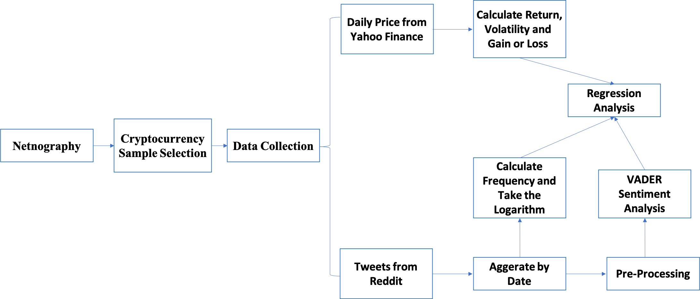

# 🧠 Crypto-Social Sentiment Analysis

This project investigates the relationship between cryptocurrency market dynamics and Reddit sentiment, leveraging advanced NLP and financial analysis techniques.


---

## 📚 Project Overview

This study analyzes how Reddit discussions correlate with cryptocurrency price movements and volatility. Data sources include:

- **Reddit posts** from 10 crypto subreddits (Nov 2022 – Mar 2023)
- **Price data** from Yahoo Finance

---

## 🛠️ Methodology

### Web Scraping Framework

- **Browser Rendering**: Selenium WebDriver with Safari
- **HTML Parsing**: BeautifulSoup (bs4), with `requests + lxml` as fallback
- **Page Navigation**: JavaScript-based scrolling (`window.scrollTo`)
- **Error Handling**: `try-except` blocks for robustness
- **Data Aggregation**: Progressive appending into Python lists

### Key Components

| Component         | Technology             | Purpose                                 |
|------------------|------------------------|-----------------------------------------|
| Browser Control  | Selenium WebDriver     | Render dynamic Reddit pages             |
| HTML Parsing     | BeautifulSoup 4        | Extract structured data                 |
| Data Storage     | Pandas DataFrame       | Store scraped content                   |
| Page Navigation  | JavaScript injection   | Infinite scroll handling                |

---

## 🔁 Data Pipeline

1. **Initialization**:
   ```python
   driver = webdriver.Safari()
   driver.get('https://www.reddit.com/r/Bitcoin/new/')
   ```

2. **Scraping Loop**:
   - Scroll → Capture HTML → Parse → Repeat
   - 2-second throttling between scrolls

3. **Data Extraction**:
   - Extract titles, text, author, votes using CSS classes and `data-*` attributes

4. **Data Structuring**:
   ```python
   pd.DataFrame({
       'title': titles,
       'text': contents,
       'user': authors,
       'votes': engagement_metrics
   })
   ```

---

## 🔍 Sentiment & Financial Analysis

### Text Processing

- Lowercasing, URL removal, regex-based tokenization
- Combined title and body: `df['text'] = df['title'] + ' ' + df['selftext']`

### Sentiment Analysis Techniques

| Method         | Library         |
|----------------|------------------|
| VADER          | `nltk.sentiment` |
| BERT           | `transformers`   |
| AFINN          | `afinn`          |
| ML Models      | `scikit-learn`   |

Example:
```python
from nltk.sentiment import SentimentIntensityAnalyzer as SIA
sid = SIA()
df['compound'] = df['text'].apply(lambda x: sid.polarity_scores(str(x))['compound'])
```

### Financial Feature Engineering

```python
df['Return'] = df['Close'].pct_change()
df['Volatility'] = df['Return'].rolling(7).std()
df['Gain'] = (df['Return'] > 2 * df['Volatility']).astype(int)
```

---

## 📈 Statistical Modeling

### Regression Analysis

```python
from statsmodels.formula.api import ols

model = ols('frequency_log ~ Three_Day_Return + C(Weekday) + C(Stable_Coin)', data=df).fit(cov_type='HC0')
```

### Key Variables

| Type        | Variable          | Description                       |
|-------------|-------------------|-----------------------------------|
| Dependent   | `frequency_log`   | Log of post frequency             |
| Independent | `Three_Day_Return`| 3-day price change                |
| Control     | `C(Weekday)`      | Day-of-week fixed effects         |

---

## 📊 Visualization Highlights

- Time-series plots of sentiment vs. price
- KDE plots for sentiment and return distributions
- Academic style: `plt.style.use('science')`

Example:
```python
with plt.style.context(['science']):
    sns.kdeplot(df['compound'], bw_method=0.2, clip=(-1, 1))
```

---

## 📌 Key Findings

1. **Sentiment-Volatility**:  
   - Negative sentiment → Higher volatility  
   - Positive sentiment → Short-term price gains

2. **Model Accuracy**:
   | Model        | Accuracy | F1-Score |
   |--------------|----------|----------|
   | VADER        | 0.68     | 0.65     |
   | BERT         | 0.72     | 0.70     |
   | Custom SVM   | 0.75     | 0.73     |

---

## ⚙️ Innovations

- Multi-time horizon return analysis (2/3/7 days)
- Stablecoin comparison (`USDC` vs others)
- HC0 robust standard errors
- Automated LaTeX output for academic use

---

## 🚧 Limitations & Future Work

- **Coverage**: Reddit-only data may miss broader sentiment
- **Bias**: Survivorship bias in coin selection
- **Extensions**:
  - Add Twitter/Telegram data
  - Use RSI/MACD indicators
  - Explore LSTM or deep learning models

---

## 📁 Output Examples

### Summary Stats (LaTeX Format)

```latex
\begin{tabular}{lrrrrr}
\toprule
Statistic & Observations & Mean & SD & Min & Max \\
\midrule
Return & 1402 & 0.002 & 0.041 & -0.217 & 0.186 \\
Volatility & 1402 & 0.038 & 0.017 & 0.008 & 0.109 \\
Sentiment & 1402 & 0.124 & 0.287 & -0.998 & 0.999 \\
\bottomrule
\end{tabular}
```

---

## 📦 Dependencies

- `selenium`, `beautifulsoup4`, `requests`, `lxml`
- `pandas`, `numpy`, `matplotlib`, `seaborn`
- `nltk`, `transformers`, `afinn`, `sklearn`
- `statsmodels`, `stargazer`

---

## 🧪 Run Instructions

```bash
pip install -r requirements.txt
python scraper.py
python analysis.py
```
